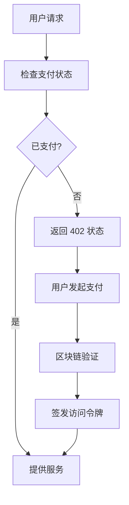

# PayAI402: x402 协议的实际应用与技术分析

> **一个基于 HTTP 402 Payment Required 标准的去中心化支付协议实现**

本项目是对 x402 协议的深度探索和实际应用，通过 AI 图像生成场景展示了如何在现代 Web 应用中实现真正的"按需付费"模式。

---

## 🔍 x402 协议深度解析

### 什么是 x402 协议？

HTTP 402 Payment Required 是 HTTP 状态码标准中一个长期被保留但很少实现的状态码。x402 协议将这个概念扩展为一个完整的去中心化支付标准：

```http
HTTP/1.1 402 Payment Required
Content-Type: application/json
X-Payment-Required: true
X-Payment-Address: 0x742d35Cc6634C0532925a3b8D404fddF4f780EAD
X-Payment-Amount: 0.1
X-Payment-Token: USDC
X-Payment-Chain: base

{
  "error": "Payment required to access this resource",
  "payment": {
    "address": "0x742d35Cc6634C0532925a3b8D404fddF4f780EAD",
    "amount": "0.1",
    "token": "USDC",
    "chainId": 8453,
    "nonce": "1698765432"
  }
}
```

### 为什么 x402 很重要？

1. **真正的微支付**: 传统支付系统手续费过高，无法支持小额支付
2. **去中心化**: 不依赖第三方支付处理商
3. **即时验证**: 区块链交易可以被任何人验证
4. **全球可用**: 无需银行账户或信用卡

---

## 🏗️ 协议实现架构

### 核心组件分析



### 1. 支付检测层 (`/app/api/generate/route.ts`)

```typescript
// 核心 402 响应逻辑
if (!paymentProof) {
  return new Response(
    JSON.stringify({
      error: 'Payment required',
      payment: {
        address: process.env.RECIPIENT_ADDRESS,
        amount: process.env.NEXT_PUBLIC_PAYMENT_AMOUNT,
        token: 'USDC',
        chainId: parseInt(process.env.NEXT_PUBLIC_CHAIN_ID!),
        nonce: Date.now().toString()
      }
    }),
    { 
      status: 402,
      headers: {
        'Content-Type': 'application/json',
        'X-Payment-Required': 'true'
      }
    }
  );
}
```

### 2. 链上验证机制

```typescript
// 交易验证的关键步骤
const verifyPayment = async (txHash: string) => {
  // 1. 获取交易详情
  const tx = await provider.getTransaction(txHash);
  
  // 2. 验证接收地址
  if (tx.to !== expectedRecipient) throw new Error('Invalid recipient');
  
  // 3. 验证金额和代币
  const decoded = decodeUSDCTransfer(tx.data);
  if (decoded.amount < expectedAmount) throw new Error('Insufficient amount');
  
  // 4. 检查确认状态
  const receipt = await provider.getTransactionReceipt(txHash);
  if (!receipt || receipt.status !== 1) throw new Error('Transaction failed');
  
  return true;
};
```

### 3. 前端支付流程

```typescript
// PaymentModal.tsx 中的支付逻辑
const handlePayment = async () => {
  try {
    // 1. 构造 USDC 转账交易
    const usdcContract = new ethers.Contract(USDC_ADDRESS, USDC_ABI, signer);
    const tx = await usdcContract.transfer(
      recipientAddress,
      ethers.parseUnits(amount, 6) // USDC 使用 6 位小数
    );
    
    // 2. 等待交易确认
    const receipt = await tx.wait();
    
    // 3. 提交支付证明
    const response = await fetch('/api/generate', {
      method: 'POST',
      headers: { 'Content-Type': 'application/json' },
      body: JSON.stringify({ 
        paymentProof: receipt.transactionHash,
        nonce: currentNonce 
      })
    });
    
    if (response.ok) {
      // 支付成功，解锁功能
      onPaymentSuccess(await response.json());
    }
  } catch (error) {
    console.error('Payment failed:', error);
  }
};
```

---

## 💡 开发者心得与最佳实践

### 挑战 1: 交易确认时间

**问题**: 区块链交易需要时间确认，用户体验不佳。

**解决方案**: 
```typescript
// 使用乐观更新 + 后台验证
const optimisticPayment = async (txHash: string) => {
  // 立即显示"处理中"状态
  setPaymentStatus('processing');
  
  // 后台轮询确认
  const checkConfirmation = async () => {
    try {
      const receipt = await provider.getTransactionReceipt(txHash);
      if (receipt && receipt.status === 1) {
        setPaymentStatus('confirmed');
        return true;
      }
    } catch (error) {
      // 继续轮询
    }
    
    setTimeout(checkConfirmation, 2000);
  };
  
  checkConfirmation();
};
```

### 挑战 2: 重放攻击防护

**问题**: 恶意用户可能重复使用同一个交易哈希。

**解决方案**:
```typescript
// 使用 nonce 和交易哈希双重验证
const usedTransactions = new Set<string>();
const nonceMap = new Map<string, number>();

const validatePayment = (txHash: string, nonce: string) => {
  // 检查交易是否已被使用
  if (usedTransactions.has(txHash)) {
    throw new Error('Transaction already used');
  }
  
  // 检查 nonce 是否有效
  const lastNonce = nonceMap.get(userAddress) || 0;
  if (parseInt(nonce) <= lastNonce) {
    throw new Error('Invalid nonce');
  }
  
  // 记录使用状态
  usedTransactions.add(txHash);
  nonceMap.set(userAddress, parseInt(nonce));
};
```

### 挑战 3: Gas 费优化

**问题**: 以太坊主网 Gas 费过高，影响小额支付。

**解决方案**: 选择 Layer 2 网络
```typescript
// 支持多链配置
const SUPPORTED_CHAINS = {
  base: {
    chainId: 8453,
    name: 'Base',
    rpcUrl: 'https://mainnet.base.org',
    usdcAddress: '0x833589fCD6eDb6E08f4c7C32D4f71b54bdA02913',
    avgGasFee: '$0.01' // 相比主网的 $5-50
  },
  polygon: {
    chainId: 137,
    name: 'Polygon',
    rpcUrl: 'https://polygon-rpc.com',
    usdcAddress: '0x2791Bca1f2de4661ED88A30C99A7a9449Aa84174',
    avgGasFee: '$0.001'
  }
};
```

---

## 🔬 技术深度分析

### USDC 转账的底层实现

```solidity
// USDC 合约的 transfer 函数调用
function transfer(address to, uint256 amount) external returns (bool) {
    address owner = _msgSender();
    _transfer(owner, to, amount);
    return true;
}

// 对应的 ethers.js 调用
const transferData = usdcContract.interface.encodeFunctionData('transfer', [
  recipientAddress,
  ethers.parseUnits(amount, 6)
]);
```

### JWT 令牌设计

```typescript
// 访问令牌的结构
interface AccessToken {
  sub: string;        // 用户地址
  txHash: string;     // 支付交易哈希
  amount: string;     // 支付金额
  timestamp: number;  // 支付时间
  exp: number;        // 过期时间
  scope: string[];    // 访问权限
}

// 令牌生成
const generateAccessToken = (paymentData: PaymentData) => {
  return jwt.sign({
    sub: paymentData.userAddress,
    txHash: paymentData.transactionHash,
    amount: paymentData.amount,
    timestamp: Date.now(),
    exp: Math.floor(Date.now() / 1000) + (24 * 60 * 60), // 24小时有效
    scope: ['image-generation']
  }, process.env.JWT_SECRET!);
};
```

---

## 🌐 实际应用场景

### 1. 内容付费

```typescript
// 文章阅读付费
app.get('/article/:id', async (req, res) => {
  const { authorization } = req.headers;
  
  if (!authorization) {
    return res.status(402).json({
      error: 'Payment required',
      payment: {
        amount: '0.05', // 5 美分阅读一篇文章
        description: 'Access to premium article'
      }
    });
  }
  
  // 验证支付后提供内容
  const article = await getArticleContent(req.params.id);
  res.json(article);
});
```

### 2. API 调用计费

```typescript
// AI API 按次计费
app.post('/api/ai/generate', async (req, res) => {
  const cost = calculateAPICost(req.body.complexity);
  
  if (!await verifyPayment(req.headers.authorization, cost)) {
    return res.status(402).json({
      error: 'Insufficient payment',
      required: cost,
      description: 'AI generation service'
    });
  }
  
  const result = await generateAIContent(req.body);
  res.json(result);
});
```

### 3. 带宽/存储付费

```typescript
// 文件下载付费
app.get('/download/:fileId', async (req, res) => {
  const fileSize = await getFileSize(req.params.fileId);
  const cost = fileSize * 0.000001; // 每 MB 0.000001 USDC
  
  if (!await verifyPayment(req.headers.authorization, cost)) {
    return res.status(402).json({
      error: 'Payment required for download',
      payment: { amount: cost.toString() }
    });
  }
  
  res.download(getFilePath(req.params.fileId));
});
```

---

## 📊 性能与成本分析

### 交易成本对比

| 网络 | Gas 费 | 确认时间 | TPS | 适用场景 |
|------|--------|----------|-----|----------|
| Ethereum | $5-50 | 1-5分钟 | 15 | 大额支付 |
| Base | $0.01 | 2-5秒 | 1000+ | 小额支付 |
| Polygon | $0.001 | 2-3秒 | 7000+ | 微支付 |

### 服务器成本

```typescript
// 零服务器成本的实现
const COST_ANALYSIS = {
  traditional: {
    server: '$50/month',      // VPS
    database: '$20/month',    // PostgreSQL
    payment: '2.9% + $0.30', // Stripe
    total: '$70/month + 3.2%'
  },
  x402: {
    hosting: '$0',            // Vercel 免费版
    database: '$0',           // 链上验证
    payment: '~$0.01',        // Gas 费
    total: '~$0.01 per transaction'
  }
};
```

---

## 🔮 x402 协议的未来展望

### 1. 标准化进程

x402 协议正在向 Web 标准发展，未来可能成为浏览器原生支持的功能：

```javascript
// 未来可能的浏览器 API
if ('payment' in navigator) {
  const payment = await navigator.payment.request({
    method: 'crypto',
    amount: '0.1',
    currency: 'USDC',
    recipient: '0x742d35Cc6634C0532925a3b8D404fddF4f780EAD'
  });
}
```

### 2. 跨链互操作性

```typescript
// 多链支付聚合
const CROSS_CHAIN_PAYMENT = {
  ethereum: { fee: '$5', time: '5min' },
  base: { fee: '$0.01', time: '2sec' },
  polygon: { fee: '$0.001', time: '2sec' },
  
  // 自动选择最优链
  selectOptimalChain: (amount: number) => {
    if (amount > 10) return 'ethereum';
    if (amount > 1) return 'base';
    return 'polygon';
  }
};
```

### 3. 隐私保护

```typescript
// 零知识证明支付
const zkPayment = {
  // 证明支付了正确金额，但不暴露具体交易
  generateProof: async (amount: number, secret: string) => {
    return await zkSnark.prove({
      amount: amount,
      secret: secret,
      nullifier: generateNullifier()
    });
  }
};
```

---

## 🛠️ 快速开始

想要实现自己的 x402 应用？查看我们的 [部署文档](./DEPLOYMENT.md) 和 [API 文档](./API.md)。

**核心文件**:
- `app/api/generate/route.ts` - 402 协议实现
- `app/components/PaymentModal.tsx` - 前端支付界面
- `scripts/generate-wallet.js` - 钱包生成工具

**在线演示**: [https://payai402.vercel.app](https://payai402.vercel.app)

---

*本项目是 x402 协议的技术验证，展示了去中心化支付在现代 Web 应用中的实际可行性。*

---

## 🌐 浏览器兼容性

### ✅ 支持
- Chrome 113+ (桌面版)
- Edge 113+ (桌面版)
- Brave (最新版)

### ❌ 不支持
- Safari (WebGPU 支持有限)
- Firefox (WebGPU 支持不完整)
- 移动端浏览器 (性能不足)

---

## 🐛 常见问题

### Q: 支付后验证失败？
**A**: 等待交易确认（约 2 秒），检查 BaseScan 确认交易状态

### Q: 模型加载失败？
**A**: 确保使用支持 WebGPU 的浏览器（Chrome 113+）

### Q: MetaMask 连接失败？
**A**: 确保已安装 MetaMask 并切换到 Base 网络

### Q: Vercel 部署失败？
**A**: 检查环境变量是否正确配置，查看部署日志

---

## 🛣️ 未来计划

- [ ] 集成真实 Stable Diffusion 模型
- [ ] 支持多链支付（Solana、Arbitrum）
- [ ] 添加语音生成功能（TTS）
- [ ] 实现支付记录仪表盘
- [ ] 提供 x402 SDK 供开发者使用

---

## 📄 许可证

MIT License

---

## 🤝 贡献

欢迎提交 Issue 和 Pull Request！

---

## 📧 联系方式

- **Telegram**: [@dsa885](https://t.me/dsa885)
- **Twitter/X**: [@hunterweb303](https://x.com/hunterweb303)
- **GitHub**: [duolaAmengweb3/PayAi402](https://github.com/duolaAmengweb3/PayAi402)

---

## 🙏 致谢

- [x402 Protocol](https://github.com/x402) - HTTP 402 支付标准
- [Base](https://base.org) - Layer 2 区块链
- [Stable Diffusion](https://stability.ai/) - AI 图像生成模型
- [Vercel](https://vercel.com) - 免费托管平台

---

**Built with ❤️ using x402 Protocol**
